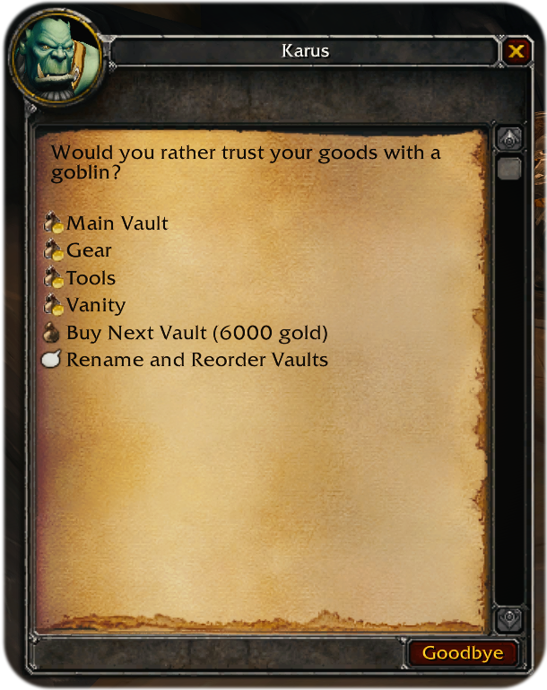

<p align="center">
  
</p>

# mod-extended-bank

Balanced bank space extension module that adds new vanilla-like bank pages or **vaults**.

No client addon, no custom frame, no client patch: right-click any banker, buy and pick a vault page from the new dialogue window and the ordinary bank UI opens showing that vault's contents.

- **7+ new vaults**, bought and used from the banker's new dialogue window, priced *very* steeply by default as a gold sink and for balance reasons.
- Each vault works exactly the same as regular bank, has the usual 28 item slots and its own 7 purchasable bag slots, bought through the vanilla bank UI.
- **Vault 1 is your normal bank.** The module never touches its storage. Turn the module off and your vanilla bank is exactly as it was.
- Vaults can be renamed, with support for colour codes and inline icons.
- Heavily tested for data safety in edge cases, including hard client *and* server crashes mid-write. But there is always room for improvement, especially in multiplayer and exploitation scenarios — issue reports are welcome!

<p align="center">
  
  <br>
  <em>Four banks, three of them renamed and reordered, on a stock client with no addon.</em>
</p>

## Disclaimer

✨Vibe-coded✨ using Claude Opus 5 and `/code-review ultra` against the [AzerothCore mod-playerbots branch](https://github.com/mod-playerbots/azerothcore-wotlk/tree/Playerbot), but rigorously tested by a real human on a solo server as much as possible — see [tools/TESTING.md](tools/TESTING.md).

Issues, PRs, reports and extra testing all very welcome. Thanks, and enjoy!

## Requirements and Installation

AzerothCore for WotLK. Playerbots branch is built and tested against, but the module has no playerbots references anywhere, so it *should* work on vanilla AzerothCore. No client changes and no other modules are needed.

* Clone the repository to your azerothcore/modules folder
* Re-run CMake
* Recompile the core
* Copy and edit `mod_extended_bank.conf.dist` to
`mod_extended_bank.conf` in your server's `configs/modules` directory.

That is the whole install.

The core picks up `data/sql/` on its own and the two database tables are created automatically by AzerothCore's own updater the next time worldserver starts.

## Using it

Right-click any banker and pick a vault from the list, then use it as your new regular bank. This works on every banker in the game.

**Buying a vault:** `Buy Next Vault` in the same menu. You get a confirmation box with the price.

**Buying bank bag slots:** Each vault has its own count so open the vault first, then use the normal purchase button in the bank frame.

**Renaming a vault or reordering their positions:** Use the `Rename and Reorder Vaults` sub-menu to reorder the list (your Main Vault always stays at the top) or rename any vault.

Colour codes and icons both work.

You can use [this article](https://wowpedia.fandom.com/wiki/UI_escape_sequences) to familiarize yourself with WoW text escape sequences. And [WoWHead](https://www.wowhead.com/wotlk/icons) (or extracted MPQs) to find the icon names.

- Colours:

```
|cff33ff00your_vault_name_here|r
```

`|cff` opens, `|r` closes, and the six characters between them are an ordinary **RRGGBB** hex
colour — `33` red, `ff` green, `00` blue for the bright green above.

- Icons:

```
|TInterface\Icons\INV_Misc_Bag_08:16|t Bags
```
Supports both icon name (`INV_Misc_Bag_08`) and size (`16`).

## Configuration

Everything is hot-reloadable with `.reload config`; no restart needed.

| Option | Default | What it does |
|---|---|---|
| `ExtendedBank.Enable` | `1` | Master switch. Set to `0` and bankers behave exactly like stock AzerothCore. |
| `ExtendedBank.MaxVaults` | `8` | Vaults per character including Vault 1, so 7 to buy. Anything outside 1–20 is clamped. |
| `ExtendedBank.VaultCost` | `"100,1000,2500,6000,18000,38000,90000"` | Price in **gold** for vault 2, 3, 4 … Last price is repeated if you have more vaults configured than listed here. |
| `ExtendedBank.AllowRestrictedItems` | `0` | **Read the warning in the config file first.** Turns off the filter described in the first two points below, letting unique and time-limited items into vaults 2+. |

Lowering `MaxVaults` later never hides or deletes anything — characters keep every vault they already own, they just cannot buy more.

Turning `AllowRestrictedItems` back off again is safe and needs no cleanup: each vault hands its offending items back the next time it is opened. What it cannot undo is a duplicate that was created while it was on.


## Important things to know

- **"Unique" items are blocked in custom vaults due to exploitation and game-breaking reasons (multiple soulstones/quest items/etc are possible otherwise).** Because items in a custom vault are invisible to the game (`Player::GetItemCount(..., inBankAlso)`, various quest and special checks), this module prohibits putting unique/quest/special and other one-of-a-kind items (basically anything with a `maxcount` or a limit category) into any vault EXCEPT the main one (your regular vanilla bank). If you try to put such an item in, the module will reject it and put it straight back in your bags, with a message from the banker and a notification saying so. If your bags are full or you try to swap the items by dragging it on top of another item in a vault, it will be mailed to you instead. **Nothing is ever lost.** Your main bank is unaffected, so keep them there. A server operator can lift this with `ExtendedBank.AllowRestrictedItems`, which the config file spells out in full.
- **Items with a time limit can only go in your main bank.** Holiday items, conjured food, anything with a countdown — a custom vault would freeze the timer while you carry on playing, so they are refused the same way unique items are, and returned to your bags or mailed. Nothing is lost. `ExtendedBank.AllowRestrictedItems` lifts this one too.
- **`.pdump` does not carry vaults.** Dumping a character this way and loading it back loses vaults 2+.
- **Faction and race changes do not convert items in vaults 2+.** Your main bank converts as usual.
- **Playerbots always use Vault 1** and are otherwise unaffected.
- **Non-Latin vault names may show as `?` on an English client using default Blizzard UI and Fonts.** Cyrillic, CJK and other non-Latin names are stored and sent correctly, but the vault list and the rename menu will render a `?`. A UI that replaces the game fonts, such as ElvUI, displays them correctly.
- **ElvUI users:** ElvUI stops showing the bank bag slot purchase button once your main bank has bought all seven, and will not show it again in a vault that has fewer. This is an ElvUI problem — the default Blizzard bank frame handles it correctly — and `/run PurchaseSlot()` works as a complete substitute. There seems to be other minor cosmetic issues with ElvUI specifically, like a very random chance of some bank slots showing empty, reopening the storage fixes it.

## Uninstalling

Disable it with `ExtendedBank.Enable = 0`, or remove the module directory and rebuild.

Your **main bank is untouched either way** — it was never stored anywhere but the usual place. Items sitting in vaults 2+ stay in the database and come back if you reinstall. To get them out first, open each vault and move its contents into your bags or your main bank.

## For developers

### IMPLEMENTATION TL;DR

Your normal bank stays exactly where the game always kept it, in the `character_inventory` table. Extra vaults live in the module's own tables. When you pick a vault from the banker's menu, the server pulls your real bank items out of memory, loads that vault's items into the same slots, and sends the client the identical "open bank" packet it always sends.

The rule everything hangs on is that **the module never moves an item between the `character_inventory` and `mod_extended_bank_vault_items` tables by itself.** What never happens is the module writing a row into your real bank or migrating one out of it, which is the only way this design could corrupt a bank that was fine before you installed it.

Original bank (Vault 1) is also the resting state: a different vault is only loaded while you're actually standing at the banker, and it's swapped back the moment you walk away, change map, or log out. So at every quiet moment, including a crash, your bank on disk looks exactly as it would if the module weren't installed. Vault contents are written out far more eagerly than the game saves your inventory — effectively on your next action rather than on the periodic core save timer — so the worst a crash can cost you is the last edit you made, **never a duplicated or destroyed item**.

The *hard part* in practice is that the server core has several routes that write inventory to the database from memory, and most of them fire no script hook at all. If a vault item is sitting in the save queue when one of them runs, it writes that item into a real bank slot — and because of a unique key on the slot, that deletes whatever your real bank had there. The module solves it by pulling vault items back out of that queue before any of those routes can run, at four separate points. That's what most of the code is actually doing.

### Documents

| Document | Covers |
|---|---|
| [IMPLEMENTATION.md](IMPLEMENTATION.md) | how it actually works, and why each mechanism exists |
| [CLAUDE.md](CLAUDE.md) | short working guide — the invariant, and the mistakes that are easy to make |
| [tools/TESTING.md](tools/TESTING.md) | test plan, with `[x]` marking what has been observed passing |
| [tools/check_invariants.sql](tools/check_invariants.sql) | read-only health check; zero rows means healthy |

Two tables are added to the characters database: `mod_extended_bank_vaults` (one row per owned vault, holding its name and purchased bag slot count) and `mod_extended_bank_vault_items` (item positions, for vaults 2+ only). Deleting a character cleans up both.

## Licence

GPL v2, matching AzerothCore.
